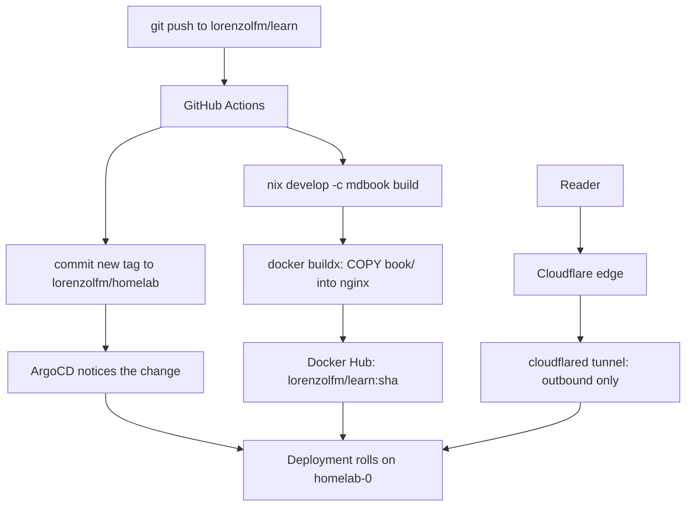

# How this site is built

The site you are reading is a static mdBook, served by nginx in a container, on
a Raspberry Pi in my flat, reachable from the internet without a single open
port on my router. This page is how the pieces fit.

## The problem it solves

Static HTML is trivial to *make* and annoying to *ship*. The usual answer is
GitHub Pages: push, and it appears. But I already run a Kubernetes cluster at
home with a GitOps pipeline, so the interesting version of the problem is
"deploy this the same way I deploy everything else" — declaratively, from git,
with no manual `kubectl apply` anywhere.

## The pipeline

Two halves. The top half is CI: build the HTML, bake it into an image, and then
edit a *different* repo — the one ArgoCD watches. Nothing in CI ever talks to
the cluster. The bottom half is the request path: the cluster dials *out* to
Cloudflare and requests arrive back down that tunnel, which is why there is no
inbound firewall rule to maintain.

## Why the book is built outside the Dockerfile

The obvious Dockerfile is multi-stage: install mdBook, run it, copy the output
into nginx. It is also the wrong one here. The cluster is arm64 and the CI
runner is x86, so the image is built with QEMU emulation — and compiling or
running a build tool under emulation is slow for no reason. Rendered HTML has no
architecture. So CI builds the book natively, and the Dockerfile does nothing
but copy files.

> [!TIP]
> The general rule: emulate only what must match the target architecture.
> Anything architecture-neutral — HTML, CSS, JSON, compiled-elsewhere assets —
> should be produced before the emulated build starts.

## One version of mdBook, not two

mdBook ships its own theme, JavaScript, and search index generator, so two
different versions produce two different sites. If I preview locally with the
version from nixpkgs and CI downloads whatever release is current, the deployed
site can quietly differ from the one I looked at.

The fix is to have exactly one version number. A `flake.nix` declares the
toolchain, `flake.lock` pins it, and CI runs `nix develop -c mdbook build`
against that same lock. Local and production are the same bytes by construction
rather than by discipline.

The same pinning argument is why this book has almost no plugins. mdBook 0.5
renders GitHub-style alerts natively, so the callouts on this page need no
preprocessor, no committed stylesheet, and no third version to keep in step.

## What confused me

> [!WARNING]
> **A NetworkPolicy is two policies.** The cluster denies pod-to-pod traffic by
> default, and I kept thinking of an allow-rule as one thing. It is not. Letting
> the tunnel reach this site needs *an ingress rule on this app* (accept from
> `app: cloudflared`) **and** *an egress rule on cloudflared* (allow out to
> `app: learn`). Write only the first and everything looks healthy — pods ready,
> ArgoCD green, probes passing — and the site returns 502, because the rejection
> happens at the sender.

> [!CAUTION]
> **Not everything is in git.** The tunnel is token-managed, which means its
> hostname routes live in the Cloudflare dashboard and *not* in the homelab
> repo. So `learn.lorenzo.sh` is one hand-made click that no amount of GitOps
> will reproduce. The repo has a comment listing the live routes; a comment is a
> weak substitute for a declaration, and it is the part of this setup most
> likely to drift.

## Where I would go deeper

- Replacing the token-managed tunnel with a config-file tunnel, so routes are
  declared in git like everything else
- `readOnlyRootFilesystem` for nginx — it needs writable `/tmp` and
  `/var/cache/nginx`, which means volumes rather than an ignore annotation
- Whether the netpol egress edges could be generated from the tunnel config
  instead of hand-maintained
